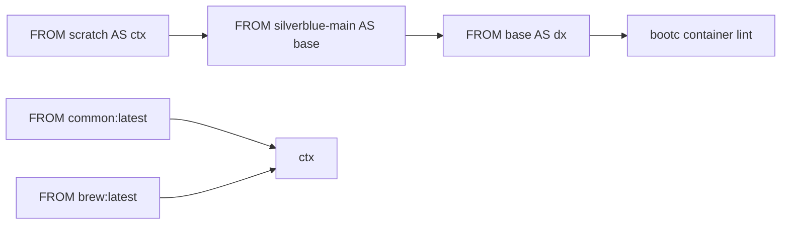

# Bluefin Architecture

This skill explains how the [Bluefin](https://projectbluefin.io/) container-image build system is structured. Bluefin is a Fedora Silverblue-based desktop OS built using container-native tooling.

## Variants

| Variant | Image Name | Purpose |
|---------|-----------|---------|
| **base** | `bluefin` | General-purpose desktop OS |
| **dx** | `bluefin-dx` | Developer experience — adds Docker, VS Code, libvirt, cockpit, QEMU, ROCm |

Each variant is built for two **flavors** (`main`, `nvidia-open`) and three **stream tags** (`stable`, `latest`, `beta`).

## 1. Construction

Bluefin images are built in a multi-stage Containerfile:



### Context stage (`FROM scratch`)
Copies three sources into `/ctx/`:
- `system_files/` — user-space configs, fonts, themes, systemd units
- `build_files/` — all build scripts (base/, dx/, shared/)
- Files merged from `ghcr.io/projectbluefin/common` and `ghcr.io/ublue-os/brew` (both pinned by digest in `image-versions.yml`)

### Base stage
Runs `build_files/shared/build.sh` which executes scripts in fixed order (see **Build Pipeline** reference). Removes `ublue-os-*` RPMs that conflict with incoming files, swaps `fedora-logos` → `generic-logos`, syncs `system_files/shared/` via rsync.

### DX stage (conditional)
Only when `IMAGE_FLAVOR=dx`. Copies `system_files/dx/`, runs `build_files/dx/00-dx.sh`, then its own test suite.

### Final lint
`bootc container lint` validates the bootc container specification.

## 2. Configuration

### Package management (`build_files/base/04-packages.sh`)

**CRITICAL — security model:**

```bash
FEDORA_PACKAGES=(pkg1 pkg2 ...)   # installed in bulk from Fedora repos (safe)
COPR_PACKAGES=(pkg1 pkg2 ...)     # installed via copr_install_isolated()
```

The `copr_install_isolated()` function (from `build_files/shared/copr-helpers.sh`):
1. Enables the COPR repo
2. **Immediately disables it**
3. Installs packages with `--enablerepo=<repo_id>`

This prevents malicious COPR repos from injecting fake versions of Fedora packages. COPRs ever globally enabled = build failure.

Version-specific packages use `case "$FEDORA_MAJOR_VERSION" in 42|43)` blocks. Package exclusions remove unwanted packages (firefox, gnome-software, podman-docker, etc.).

### Upstream image pinning (`image-versions.yml`)

```yaml
images:
  - name: silverblue-main   # base OS
    digest: sha256:...
  - name: common            # shared user-space layer
    digest: sha256:...
  - name: brew              # Homebrew layer
    digest: sha256:...
```

All pinned by digest. Cosign verification is mandatory before build (enforced in Justfile `verify-container` recipe).

### Fedora version detection
Dynamically resolved at build time by inspecting upstream image labels via `skopeo inspect`. No hardcoded version number — `just fedora_version` queries `ghcr.io/ublue-os/base-main:<tag>`.

## 3. Building

### Prerequisites
- `just` command runner
- `podman` or `docker`
- `cosign` (auto-installed by Justfile if missing)
- `skopeo`, `jq`, `yq`

### Build commands (30-60 min, 20GB+ disk)

```bash
just build bluefin latest main          # base, main flavor, latest stream
just build bluefin-dx latest main        # dx variant
just build bluefin stable main "" "" "" "6.10.10-200.fc40.x86_64"  # pinned kernel
```

### Validation
```bash
pre-commit run --all-files   # JSON/YAML/TOML syntax, EOF, trailing whitespace
just check                   # Justfile syntax validation
just fix                     # auto-format Justfiles
```

### Cosign verification chain
Before building, the Justfile verifies every upstream image with cosign:
1. `silverblue-main` (ublue-os main key)
2. `akmods` (kernel module build image)
3. `common` (projectbluefin cosign key)
4. `brew` (ublue-os cosign key)

Failure = build aborted.

### Build script execution order
See `references/build-pipeline.md` for per-script details.

## 4. Deployment

### Stream tags

| Tag | Update Frequency | Upstream Base | Notes |
|-----|-----------------|---------------|-------|
| `stable` | Weekly (Tuesday) | quay.io/fedora/fedora-coreos:stable | Also tagged `gts`, `stable-daily` on non-Tuesday |
| `latest` | On main push | ublue-os/base-main:latest | Rolling, Fedora version floats |
| `beta` | On main push | ublue-os/base-main:beta | Fedora pre-release testing |

### CI/CD pipeline (GitHub Actions)
1. **Trigger**: schedule (stable), merge-group/push (latest/beta), or workflow_dispatch
2. **Build**: `reusable-build.yml` calls `just build-ghcr` with `sudo -E`
3. **Rechunk**: post-processes the built OCI image to optimize ostree layer structure
4. **Secureboot check**: verifies kernel vmlinuz is signed with ublue akmods certificates
5. **Tag generation**: `just generate-build-tags` produces versioned tags (e.g., `42.20250514`, `latest-42.20250514`)
6. **Push to GHCR**: pushes all tags to `ghcr.io/ublue-os/<image-name>:<tag>`
7. **Sign**: cosign signs the image digest with `SIGNING_SECRET`
8. **SBOM**: generates SPDX SBOM via Syft, attaches as OCI artifact, signs it
9. **Attestation**: GitHub Attestation for supply chain security

### Version scheme
```
# stable
<fedora_version>.<YYYYMMDD>[.<point>]    e.g., 42.20250514.1

# latest/beta
<tag>-<fedora_version>.<YYYYMMDD>[.<point>]  e.g., latest-42.20250514
```
Point increments when multiple builds land on the same day (detected by checking GHCR tags).

## Cross-project relationships

| Repository | Role |
|-----------|------|
| `ublue-os/silverblue-main` | Upstream base image |
| `projectbluefin/common` | Shared user-space files (bundled into Bluefin) |
| `ublue-os/brew` | Homebrew installation layer |
| `ublue-os/akmods` | Kernel module builds for NVIDIA/ZFS |
| `ublue-os/packages` | Some COPR packages consumed by Bluefin |
| `ublue-os/bluefin-docs` | User-facing documentation |
| `ublue-os/bluefin-lts` | Long-term support variant |

## Validated repos policy (SECURITY)

After all packages are installed, `build_files/shared/validate-repos.sh` checks every `.repo` file in `/etc/yum.repos.d/`. Any repo with `enabled=1` causes a build failure — no YUM repo may remain globally enabled on the final image. This prevents compromised dependency mirrors from affecting running systems.

## Reference files

For deeper detail, read the relevant reference:
- `references/build-pipeline.md` — per-script breakdown + execution rationale
- `references/package-model.md` — security model, repo disabling, COPR isolation examles
- `references/deployment.md` — tag scheme details, release workflows, OCI signing
