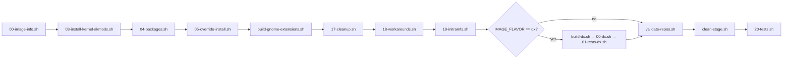

# Build Pipeline

Execution order as defined in `build_files/shared/build.sh`:

## Script details

### 00-image-info.sh
Generates `/usr/share/bluefin/image-info.json` with image metadata. Writes `os-release` fields (IMAGE_ID, IMAGE_VERSION, etc.). Runs first because other scripts may reference image metadata.

### 03-install-kernel-akmods.sh
Installs the kernel RPM and akmod packages (kernel modules). Uses `KERNEL` build arg to pin a specific kernel version. Without pin, resolves from `ublue-os/akmods` image labels.

Installs from `ublue-os/akmods` COPR for matching kernel flavor (coreos-stable for stable, main for latest/beta, bazzite for hwe).

### 04-packages.sh
Main package installation. See `references/package-model.md` for full details.

### 05-override-install.sh
Package overrides using `rpm-ostree override replace`. Used to pin specific package versions to work around regressions.

### build-gnome-extensions.sh
Builds GNOME Shell extensions from git submodules in `system_files/shared/usr/share/bluefin/gnome-extensions/`. Compiles schemas, installs to system paths.

### 17-cleanup.sh
Systemd service management: enables `flatpak-nuke-fedora` and `flatpak-preinstall`. Removes `flatpak-add-fedora-repos.service` to prevent shipping Fedora flatpaks. Enables `ublue-system-setup.service` for first-boot configuration.

### 18-workarounds.sh
Temporary fixes for known issues. Regenerates locale configuration. Most workarounds are short-lived — check git log for current context.

### 19-initramfs.sh
Regenerates initramfs with `dracut --force --regenerate-all`. Required after kernel changes to ensure bootable image.

### 20-tests.sh (base)
Validates:
- ublue signing keys present and correct SHA256
- Expected files exist (`/usr/bin/ujust`, flatpak preinstall, Brewfile, etc.)
- No `flatpak-add-fedora-repos.service` present
- Required packages installed (distrobox, fish, flatpak, mutter, pipewire, gnome-shell, etc.)
- Unwanted packages absent (fedora-logos, firefox, gnome-software, podman-docker)
- NVIDIA packages present on nvidia flavor
- Critical systemd units enabled (rpm-ostree-countme, tailscaled, ublue-system-setup, uupd)

### 01-tests-dx.sh (dx only)
Validates:
- Required DX packages present (code, docker-ce, containerd.io, libvirt, qemu, etc.)
- Systemd units enabled (docker.socket, podman.socket)

### validate-repos.sh
Enforces the validated repos policy — all YUM repos must be disabled on final image.

### clean-stage.sh
Final cleanup: disables `flatpak-add-fedora-repos`, masks it, removes the unit file. Runs `dnf clean all`. Must be last to guarantee no cleanup-recreated artifacts.
