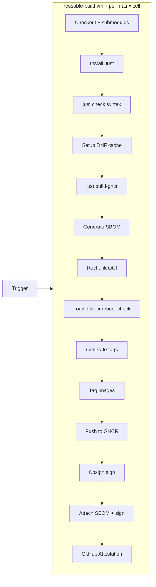

# Deployment

## Stream tag scheme

### stable
- Updated **weekly on Tuesday** via scheduled GitHub Actions workflow
- Upstream: `quay.io/fedora/fedora-coreos:stable`
- Tag format: `<fedora_version>.<YYYYMMDD>[.<point>]`
  - Example: `42.20250514`, `42.20250514.1`
- Aliases: `stable`, `stable-<version>`, `stable-daily`, `stable-daily-<version>`, `gts`, `gts-<version>`
- `stable-daily` tag is produced on every CI run; the `stable` and `gts` aliases are only updated on the weekly Tuesday run (or manual `workflow_dispatch`)

### latest
- Updated on every push to `main` (merge group)
- Upstream: `ghcr.io/ublue-os/base-main:latest`
- Tag format: `latest-<fedora_version>.<YYYYMMDD>[.<point>]`
  - Example: `latest-42.20250514`
- Aliases: `latest`, `latest-<version>`, `<fedora_version>`, `<fedora_version>-<version>`

### beta
- Updated on every push to `main`
- Upstream: `ghcr.io/ublue-os/base-main:beta`
- Same tag scheme as latest
- `fedora-updates-testing.repo` is allowed to remain enabled for beta builds

## Point version detection

When multiple builds land on the same day, the Justfile checks `ghcr.io` for existing tags with the same date and increments a `.N` suffix:

```bash
$ just build bluefin latest main  # first build → latest-42.20250514
$ just build bluefin latest main  # same day  → latest-42.20250514.1
```

## CI/CD workflow

Triggered by: `build-image-stable.yml`, `build-image-latest-main.yml`, `build-image-beta.yml`, or `build-images.yml` (manual all-streams dispatch).



Matrix dimensions:
- 2 base names (`bluefin`, `bluefin-dx`)
- 1-2 flavors (`main`, `nvidia-open`)
- 1 stream name

Total: up to 4 concurrent builds per workflow invocation.

## release.yml

After all builds complete, `generate-release.yml` creates a GitHub Release with changelog.

## Secureboot

The kernel `vmlinuz` must be signed with ublue akmods certificates. Verified by `just secureboot` during CI. Uses `sbverify` against two certificates:
- `public_key.der` — main signing key
- `public_key_2.der` — fallback key

Both keys are fetched from `github.com/ublue-os/akmods/raw/main/certs/`.

## Cosign signing

- **Key**: `SIGNING_SECRET` GitHub secret
- **Mode**: Key-based (not keyless/experimental)
- **Scope**: Every pushed image digest + SBOM OCI artifact
- **Verification at build time**: Upstream images verified before build starts

## SBOM

Generated by Syft from the exported container filesystem. Attached as an OCI artifact (SPDX JSON format) using ORAS. The SBOM artifact is also cosign-signed.

## Retagging

Manual retag utility via `just retag-nvidia-on-ghcr`. Used to promote NVIDIA image tags after a successful build:

```bash
GITHUB_USERNAME=myuser GITHUB_PAT=ghp_... just retag-nvidia-on-ghcr stable-daily-42.20250126.3 stable-daily 0
```

## DNF package cache

Cached between CI runs to speed up builds. Only `bluefin-dx` builds are allowed to write new cache entries (controlled by `just setup-cache`). Cache is stored by `actions/cache` keyed on image + Fedora version.
